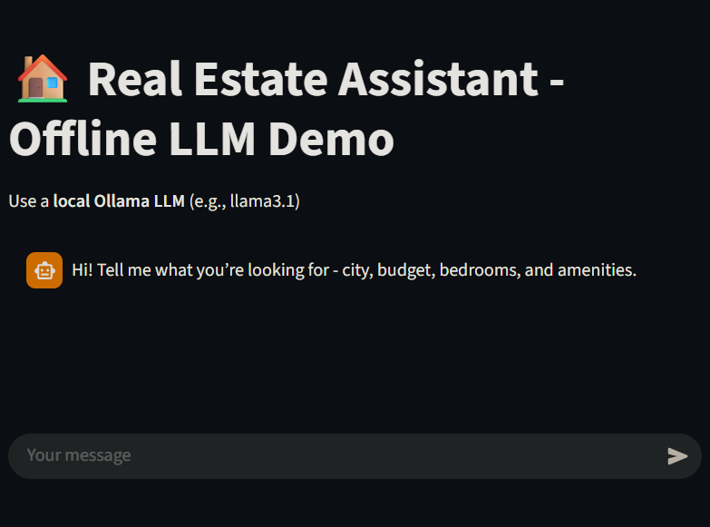

# Real Estate Assistant — Offline (Ollama) Demo

AI-powered assistant that helps users find real estate properties locally using an offline LLM model.



### Setup


```bash
# Install Ollama: https://ollama.com/download

ollama pull qwen2.5:3b-instruct-q4_K_M

pip install -r requirements.txt

# Streamlit UI
streamlit run apps/app.py

# or CLI
python apps/cli.py
```

## Dockerfile

From the folder containing Dockerfile

```bash
docker compose up --build
```
